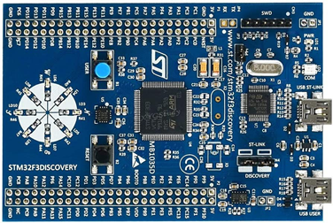
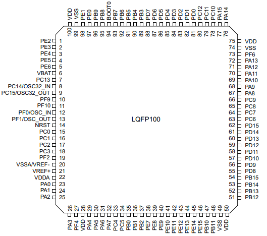
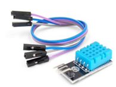

:reproducible:

:description: Kursovaya
:keywords: AsciiDoc
:imagesdir: img
:figure-caption: Рисунок
:table-caption: Таблица

:toc-title: Содержание
:toc:

[#_курсовой]
= Курсовой

[text-right]
--

--

== Глава 1. Обзор литературы и постановка задачи

Программное обеспечение должно быть выполнено на базе отладочной платы STM32 с ядром ARM Cortex.

Программное обеспечение должно измерять температуру. Период измерения 1 с.

К измеренному значению должен быть применен цифровой фильтр вида

.digitalFilter
image::digitalFilter.png[]

где t изменяется с шагом dt = 1 с (период измерения); Value – текущее измеренное значение; oldValue – предыдущее значение с выхода фильтра.

Вывод значений температуры осуществляется по интерфейсу USART 1 раз в 3 секунды.

Для программирования микроконтроллеров семейства STM32 используются интерфейсы
JTAG (Joint Test Action Group) и SWD (SerialWire Debugging).
На рисунке 1 изображена отладочная плата STM32F3Discover. +

.Отладочная плата STM32F3Discovery

Один из важных элементов платы – встроенный отладчик ST Link,
который не совместим с другими производителями.
Отладчик реализован на микроконтроллере STM32F303VC и позволяет записать программу
в базовый микроконтроллер (МК) и отследить её работу.

Микроконтроллер STM32F303VC – представитель семейства Cortex–M4.
Это семейство хорошо подходит для приложений, где требуются пониженная стоимость
и энергопотребление, малые габариты, относительно невысокая производительность
(измерительные устройства, интерфейсы, автомобильные и промышленные системы управления,
медицинское оборудование). Микроконтроллер выполнен на высокопроизводительном
32 разрядном RISC ядре Arm® Cortex® –M4, работающим на частоте до 72 МГц.

Плата работает в диапазоне температур от –40°C до +85°C, при напряжении питания
от 2,0 В до 3,6 В. В микроконтроллере располагается внутренний RC генератор на 8 мГц.
На рисунке 2 показано, что микроконтроллер имеет 100 пинов, часть из которых подключена
к линиям GPIOA, GPIOB, GPIOC, GPIOD, GPIOE, GPIOF, а часть отводится
на такие пины как подача питания, заземление, линии прошивки микроконтроллера

.Цоколёвка STM32F303VC LQFP100

Микропроцессор реализует гарвардский принцип организации с использованием RISC – архитектуры,
которая ориентирована в основном на однотактное выполнение
арифметических и логических команд в регистрах, а связь с памятью выполняется
командами записи/чтения.

В рамках курсового проекта будут использоваться следующие возможности ядра:

- RTOS;
- Передача информации от платы с помощью USART;
- Датчик температуры DHT11.

=== RTOS

Операционные системы реального времени (ОСРВ(RTOS)) предназначены для
обеспечения интерфейса к ресурсам критических по времени систем реального времени.
Основной задачей в таких системах является своевременность (timeliness) выполнения
обработки данных.

Каждый таск – это по сути мини подпрограмма, которая имеет свою точку входу,
и исполняется внутри бесконечного цикла и обычно не должна выходить из него,
а также имеет собственный стэк. Одно определение таска может использоваться для
создания нескольких тасков, которые будут выполняться независимо и также иметь собственный стэк.

=== USART

Устройство имеет три встроенных синхронные/асинхронные приёмники передатчики
(USART1, USART2 и USART3). Интерфейсы USART могут обмениваться данными со скоростью
до 9 Мбит/с. Обеспечивают аппаратное управление сигналами CTS (сигнал, блокирующий отправку
данных) и RTS (сигнал показывающий готовность отправки данных), поддерживают: многопроцессорный
режим связи, однопроводной полудуплексный режим связи и имеют возможность LIN Master/Slave.
Интерфейсы USART могут обслуживаться контроллером DMA.

*Основные характеристики USART*. USART имеет возможность автоматически подбирать
скорость передачи данных. Передаёт информацию по 8 бит. Полученные/отправленные
байты буферизуются в зарезервированной SRAM с использованием DMA.
Раздельное управление полярностью сигнала для передачи и приема.
Сменная конфигурация контактов Tx/Rx.

Любая двунаправленная связь USART требует как минимум двух контактов: прием данных (Rx)
и передача данных (Tx).

- Rx – получение ввода данных, это последовательный ввод данных,
который для восстановления данных использует методы передискретизации и различает
достоверные входящие данные от шума.
- TX – передача выходных данных. Когда передатчик отключен, выходной контакт возвращается
к своей конфигурации порта ввода вывода. Когда передатчик включен и ничего не должно
передаваться, вывод Tx находится на высоком уровне.

В данном микроконтроллере есть три USART (USART 1, USART 2 и USART 3). Будем использовать USART 3.
Для того чтобы использовать его, необходимо сделать следующее:

- Разрешаем тактирование порта GPIOC.
- Назначаем альтернативную функцию для ног GPIO10 и GPIO11.
- Выбираем режим работы ноги. GPIO10 - режим записи, GPIO11 - режим чтения.
- Инициализируем ногу. Устанавливаем скорость общения.

USART способен осуществлять непрерывную связь с использованием DMA,
где запросы буфера Rx и буфера Tx генерируются независимо.

=== Датчик температуры DHT11

DHT11 – это цифровой датчик влажности и температуры, состоящий
из термистора и емкостного датчика влажности.
Внешний вид датчика представлен на рисунке 4.

Датчик состоит из двух частей – емкостного датчика температуры и гигрометра.
Первый используется для измерения температуры, второй – для влажности воздуха.
Находящийся внутри чип может выполнять аналого-цифровые преобразования и выдавать
цифровой сигнал, который считывается посредством микроконтроллера.

.Датчик температуры DHT11

Технические характеристики:

-	Потребляемый ток – 2,5 мА (максимальное значение при преобразовании данных);
-	Измеряет влажность в диапазоне от 20% до 80%. Погрешность может составлять до 5%;
-	Применяется при измерении температуры в интервале от 0 до 50 градусов (точность – 2%)
-	Габаритные размеры: 15,5 мм длина; 12 мм широта; 5,5 мм высота;
-	Питание – от 3 до 5 Вольт;
-	Одно измерение в единицу времени (секунду). То есть, частота составляет 1 Гц;
-	4 коннектора. Между соседними расстояние в 0,1.

Передача данных осуществляется по последовательному интерфейсу (Single-Wire Two-Way).
На DHT-11 шина данных подключается с резистором к VDD (Vcc). Поэтому, если ничего не происходит, напряжение на шине равно VDD (Vcc). Логический уровень сигнала в этом случае определяется не напряжением на шине, а длительностью импульса.

Процесс общения с датчиком разделен на три основные стадии:

1. Запрос к датчику
2. Ответ датчика о готовности
3. Передача данных

*Запрос к датчику*. Чтобы датчик отправил показания, нужно послать ему соответствующий запрос.
Он состоит в том, чтобы опустить напряжение в шине более чем на 18 мс,
а затем подтянуть ее обратно на 20–40 мкс. Это действие выводит датчик из спящего режима.
Сразу после отпускания уровня в шине надо переключиться на прием и ждать ответа датчика.

*Ответ датчика о готовности*. Это автоматический ответ от датчика, который указывает, что он получил ваш запрос.
Датчик опускает уровень сигнала в шине примерно на 54 мкс и снова подтягивает на 80 мкс. После этого в шину пойдут данные.

*Передача данных*. Один цикл передачи данных длится около 4 миллисекунд.
Полный пакет данных состоит из 40 бит (5 пять блоков по 8 бит).
Формат пакета следующий: первые два блока — это значение влажности (целая и десятичная часть, каждая по 8 бит),
следующие два блока — это значение температуры (целая и десятичная часть, каждая по 8 бит),
последний блок — это 8 бит контрольной суммы.
Контрольная сумма — это сумма первых четырех блоков.
Если ее значение не совпадает с суммой первых четырех блоков, значит полученные данные не верны.

Перед каждым битом уровень в шине опускается на 54 мкс, затем шина снова подтягивается к питанию на 24 или 70 мкс.
От длительности этого импульса зависит «0» или «1» была передана.

После передачи пакета данных датчик снова опускает уровень в шине на 54 мкс,
после чего уходит в спящий режим, и шина снова подтягивается к питанию.

Так как, для работы с датчиком необходима одна ножка, то выберем порт D, gpio0. В ходе работы ножка будет конфигурироваться как на вход, так и на выход.

== Глава 2. Анализ и дизайн программы

=== Анализ

Необходимо подключить температурный датчик к плате, а саму плату к компьютеру.
Для подключения датчика был выбран порт D, gpio 0. Данная ножка будет во время работы программы переконфигурироваться на вход/выход в зависимости от приёма/передачи данных.
Поэтому необходимо запоминать инициализацию порта, чтобы динимачески изменять его.
Для общения с компьютером, необходимо настроить USART 3. Скорость общения выбирем 9600.
По заданию необходимо 1 раз в секунду получать данные с датчика, а отправлять данные на компьютер раз 3 секунды.
Это можно реализовать с помощью двух задач, каждая из которых будет иметь своё время исполнения.

=== Дизайн программы
Проанализировав требования, составим дизайн программы, обозначим классы и их методы.
*ITread*  - класс задач ОСРВ.
Всего будет 2 задачи: +
*UsartTask* - задача, передаёт данные раз в три секунды. +
*TempTask* - задача, которая получает данные раз в секунду. +

В архитектуре присутствуют следующие классы: +
*Gpio_TypeDef* - настройка пинов устройства. +
*DHT_data* - формат данных с температурного датчика. +
*DHT_sensor* - работа с температурным датчиком. +
*DigitalFilter* - цифровой фильтр с заданными параметрами. +
*TempDevice* - по code получает новые данные с температурного датчика и пропускает через фильтр. +
*UsartUser* - по code инициализирует интерфейс Usart, отвечает за передачу данных.

В архитектуре присутствуют интерфейсы: +
*iUsart* - который имеет переопределяющийся метод *Send*.
Данный метод по code отправляет данные. +
*iFilter* - который имеет переопределяющийся метод *Filter*.
Данный метод по code фильтрует данные. +

[plantuml]

----
class ITread
{
  + Execute(): void
}

ITread <|-- TempTask
ITread <|-- UsartTask

class Gpio_TypeDef
{
    - MODER: uint32_t
    - OTYPER: uint32_t
    - OSPEEDR: uint32_t
    - PUPDR: uint32_t
    - IDR: uint32_t
    - ODR: uint32_t
    - BSRR: uint32_t
    - LCKR: uint32_t
    - AFR: uint32_t
    - BRR: uint32_t
    + GPIO_TypeDef()
}

class DHT_data
{
    - hum : float
    - temp : float
    + DHT_data()
}

class DHT_sensor
{
    - lastTemp: float
    - lastHum: float
    - data: DHT_data
    - initGpio() : void
    - goToOutput() : void
	- goToInput() : void
	- lineDown() : void
	- lineUp() : void
    - getLine() : bool
    + DHT_sensor()
}

DHT_sensor o-- Gpio_TypeDef
DHT_sensor o-- DHT_data

class DigitalFilter
{
    - R: double
    - C: double
    - tau: double
    + DigitalFilter(R: double, C: double, tau: double)
    + Filter(oldValues: double*, lenOldValues: uint16_t, double newValue) : double
}

class iFilter
{
    + Filter(oldValues: double*, lenOldValues: uint16_t, double newValue): double
}

class TempDevice
{
    - sensor: DHT_sensor
    - filter: iFilter*
    - oldValueTemp: double*
    - newValueTemp: double
    - oldValueHum: double*
    - newValueHum: double
    + TempDevice()
    + getTemp(): double
    + gerHum(): double
}

TempDevice o-- DHT_sensor
TempDevice <|-- iFilter
DigitalFilter -.|> iFilter

class TempTask
{
    - _parametr:  TempDevice
    + TempTask(parametr: TempDevice)
}

TempTask o-- TempDevice

class iUsart
{
    + Send(msg: char*): void
}

class UsartUser
{
    + UsartUser()
    + Init(): void
    + Send(msg: char*): void
}

class UsartTask
{
    - _parametr:  UsartTask
    + UsartTask(parametr: UsartTask)
}

UsartTask <|-- iUsart
UsartUser -.|> iUsart

----

